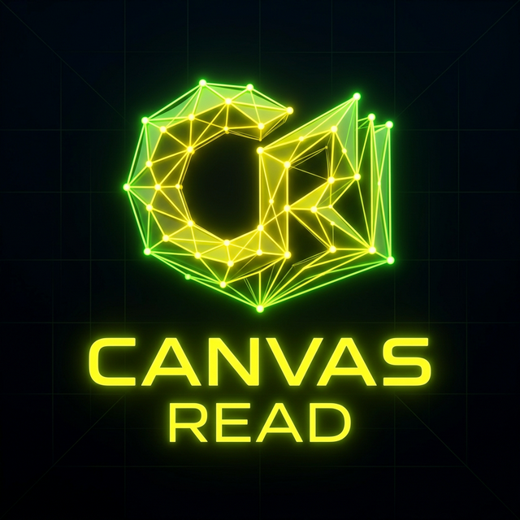

#  CanvasRead

### **The Web Went Dark. We Turned The Lights On.**

**World's First 3D Web Intelligence Layer.** 

Modern AI agents, scrapers, and accessibility tools are completely blind to `40%` of the web that renders inside `<canvas>` and WebGL. CanvasRead solves this by providing a high-performance scene graph extraction and 3D intelligence layer for the modern web.

---

## 🚀 The Vision: Beyond OCR

CanvasRead isn't just "reading text". It's a **Clone Studio** that reconstructs the underlying logic and geometry of 3D environments, complex data visualizations, and interactive canvases.

- **Capture**: Snap high-fidelity frames from any `<canvas>` element.
- **Clone**: Reconstruct the scene graph into a machine-readable JSON spec.
- **Analyze**: Perform queryable searches on 3D geometry and interactive nodes.

## ✨ Core Capabilities

### 🏢 Clone Studio Pipeline
Transform opaque canvas pixels into a standard JSON specification. Perfect for building replicas, snapshots, or automated auditing tools.

### 📊 WebGL Benchmarking
High-performance analysis of render cycles and geometry complexity. Built on **NVIDIA NIM** for lightning-fast inference.

### ♿️ Accessibility Injection
Inject ARIA-compliant metadata into blind canvas regions, making 3D data visualizations accessible to screen readers for the first time.

### 🤖 MCP Agent Integration (Optional)
A powerful Model Context Protocol (MCP) server that allows AI agents (like Claude Desktop) to "see" and interact with canvas-heavy sites directly.

---

## 🛠 Tech Stack

- **Framework**: [Next.js 15](https://nextjs.org/) (App Router, Turbopack)
- **3D Engine**: [Three.js](https://threejs.org/) / WebGL
- **Intelligence**: NVIDIA NIM API / JSON Schema Clone Spec
- **Styling**: Tailwind CSS
- **Deployment**: Render / Docker

## ⚡️ Quick Start

### 1. Prerequisites
Ensure you have Node.js 18+ and `npm` installed.

### 2. Installation
```bash
git clone https://github.com/ho-cyber/CanvasRead.git
cd CanvasRead
npm install
```

### 3. Development Server
```bash
npm run dev
```
Open [http://localhost:3000](http://localhost:3000) to enter the **Live Studio**.

### 4. Running Benchmarks
Check the performance of your canvas cloning pipeline:
```bash
node scripts/benchmark.mjs
```

---

## 🌍 Open Source & Community

CanvasRead is built for the community. If you're building a tool that needs to "see" the 3D web, we want to hear from you.

- **GitHub**: [ho-cyber/CanvasRead](https://github.com/ho-cyber/CanvasRead)
- **License**: MIT

---

<p align="center">
  Built with ❤️ for the future of the 3D Web.
</p>
